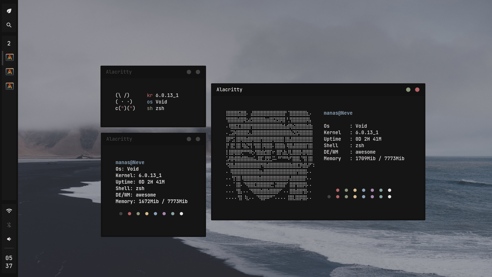

# fetch
Simple system fetch utility for Linux
<p>
  
</p>

# Install
```
  git clone https://github.com/Manas140/fetch.git && cd fetch
  ./install.sh i
```

# Help
```
  Usage: fetch [-n|o|k|u|s|d|m|h]
  Options:
    [Name|Os|Kernel|Uptime|Shell|Desktop|Memory|Help]
  Example Usage:
    fetch -nosd
```
